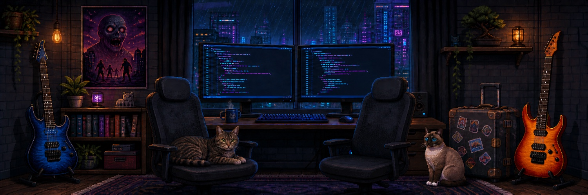

## Hey sudo? 👋

I design and build backend and cloud-native systems.

Computer engineer by training and backend builder at heart, I’ve spent over two decades building software across different languages, platforms, and architectures.

I’m passionate about thoughtful software design and staying hands-on with the code. I enjoy learning, experimenting, and exploring better ways to build clean, reliable systems.

### GitHub at a glance

<picture>
  <source media="(prefers-color-scheme: dark)" srcset="https://github-profile-summary-cards.vercel.app/api/cards/profile-details?username=lorival&theme=github_dark">
  <source media="(prefers-color-scheme: light)" srcset="https://github-profile-summary-cards.vercel.app/api/cards/profile-details?username=lorival&theme=github">
  
</picture>

### Currently

- 📖 Reading: *Software Engineering: A Practitioner’s Approach* by Roger S. Pressman and Bruce R. Maxim
- 🌱 Learning: AWS optimization and AI-assisted software engineering
- 🎨 In my spare time: Exploring how to build a brand from scratch and bring a product to market

### Beyond the code

- ☕ Firmly on team coffee, though I enjoy a good cup of tea now and then
- 😸 Happily owned by two cats, Thor and Maria
- 🎮 Survivor in The Last of Us, Resident Evil, Dead Space, Left 4 Dead, How to Survive and The Walking Dead
- ✈️ Exploring the world side by side with my wife, Endy
- 🎸 Amateur electric guitar player into blues and rock 'n' roll
- 🛠️ I enjoy making things with my hands, cooking and repairing before replacing
- 🥾 Happiest on a trail, surrounded by nature and away from the noise
- 📚 Curious about philosophy, history, anthropology, sci-fi and the cultures that shape us

---

*Last updated: August 2026*
